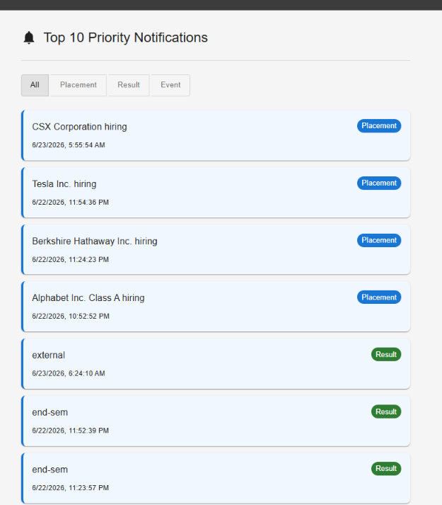
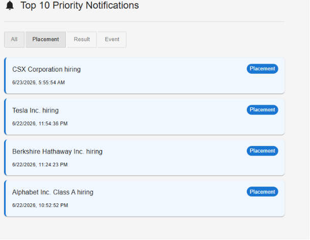
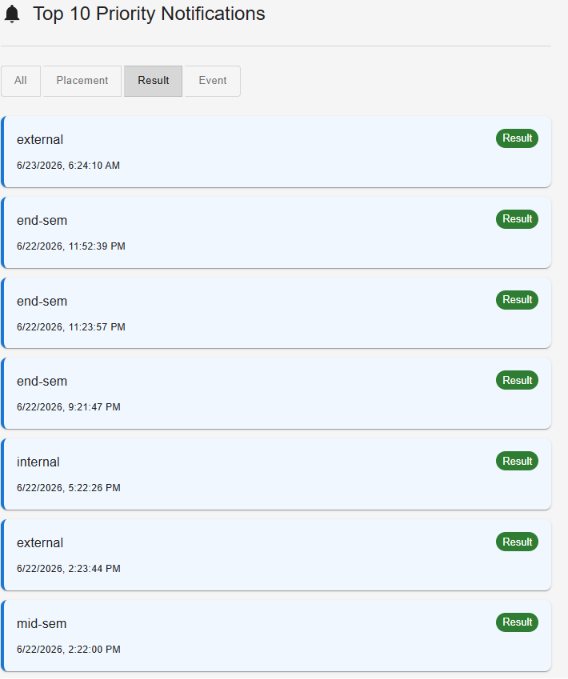
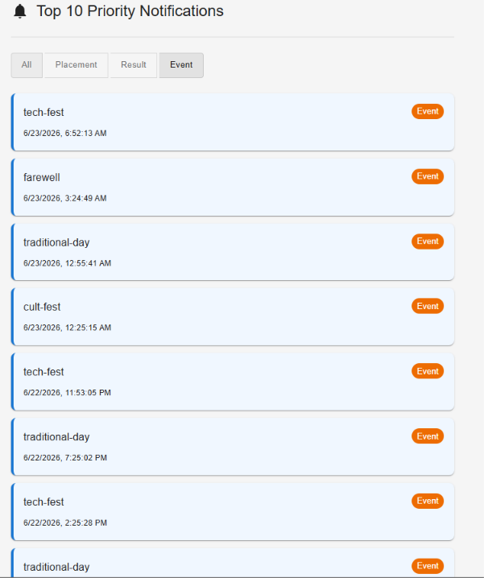

# Notification System Design

## Top 10 Priority Notifications

The frontend displays only the top 10 notifications after applying the selected filter.

## Priority Determination

Notifications are sorted using the following priority order:

1. Placement notifications have the highest priority.
2. Result notifications have medium priority.
3. Event notifications have the lowest priority.
4. Within the same notification type, newer notifications are shown before older notifications.

Priority Order:

```text
Placement > Result > Event
```

## Output Screenshots

### Top 10 Priority Notifications



### Placement Notifications



### Result Notifications



### Event Notifications



## Explanation Of Approach

The application fetches notifications from the Notification API.

After receiving the data:

1. Notifications are filtered according to the selected notification type.
2. A priority value is assigned to each notification:

   * Placement = 3
   * Result = 2
   * Event = 1
3. Notifications are sorted by:

   * Priority value (highest first)
   * Timestamp (newest first)
4. Only the first 10 notifications are displayed.

This approach keeps the implementation simple, readable, and suitable for the current dataset size.

## Maintaining Top 10 Efficiently

The current implementation sorts the notifications and displays the first 10 results.

For larger datasets, a Min Heap of size 10 can be used:

1. Calculate priority for every notification.
2. Maintain only the top 10 notifications in the heap.
3. When a new notification arrives:

   * Insert it if fewer than 10 notifications exist.
   * Otherwise compare it with the lowest-priority notification.
   * Replace the lowest-priority notification if the new notification has higher priority.

Complexity:

* Current approach: O(n log n)
* Min Heap approach: O(n log 10) ≈ O(n)

For this evaluation, the sorting approach was chosen because the notification dataset is small and easy to manage.
